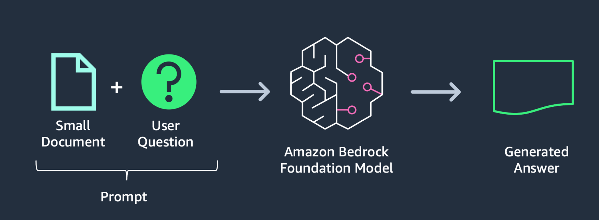

# AWS-Educational-Assistant

This is a simple demo of Amazon Bedrock and Anthropic Claude 3 Sonnet model with LangChain and Streamlit. For more details, please refer to the following links:
- [Amazon Bedrock](https://aws.amazon.com/bedrock/)
- [Claude 3](https://www.anthropic.com/news/claude-3-family)

## To View Demo and Sample Data

- Access the `demo` folder for demo videos.
- Access the `samples` folder for sample videos.

## Setup Guide

### Step 1: Install Python

Ensure Python is installed on your system. Follow the instructions for your operating system:
- [Install Python on Linux](https://docs.python-guide.org/starting/install3/linux/)

### Step 2: Setup Python Environment

Create a virtual environment to manage your dependencies:
- [Setup Python Environment](https://docs.python-guide.org/starting/install3/linux/)

### Step 3: Install AWS CLI

Install and configure the AWS Command Line Interface (CLI):
- [Install AWS CLI](https://docs.aws.amazon.com/cli/latest/userguide/getting-started-quickstart.html)

### Step 4: Clone the Repository

Clone the AWS-Educational-Assistant repository to your local machine:
```bash
git clone https://github.com/awsstudygroup/AWS-Educational-Assistant
```

### Step 5: Navigate to the Project Directory

Change to the project directory:
```bash
cd AWS-Educational-Assistant
```

### Step 6: Install Dependencies

Install the required Python packages:
```bash
pip3 install -r requirements.txt
```

### Step 7: Run the Streamlit Application

Start the Streamlit application:
```bash
streamlit run Home.py --server.port 8080
```

## Architecture



## Learn More About Prompt and Claude 3

- [Introduction to Prompt Design](https://docs.anthropic.com/claude/docs/introduction-to-prompt-design)
- [Model Card](https://www-cdn.anthropic.com/de8ba9b01c9ab7cbabf5c33b80b7bbc618857627/Model_Card_Claude_3.pdf)
